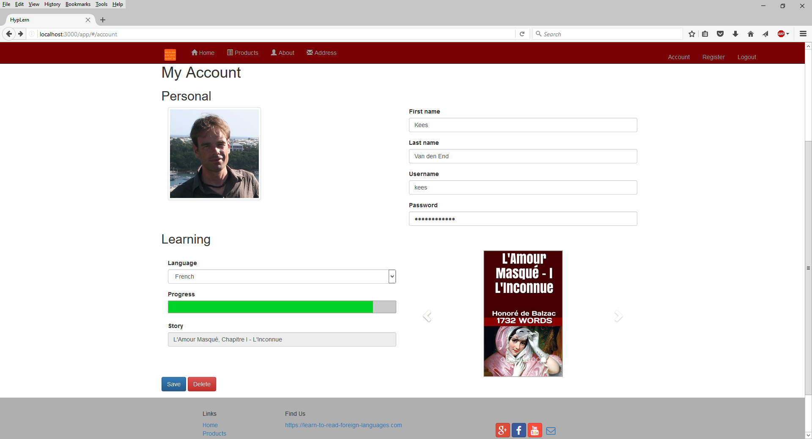
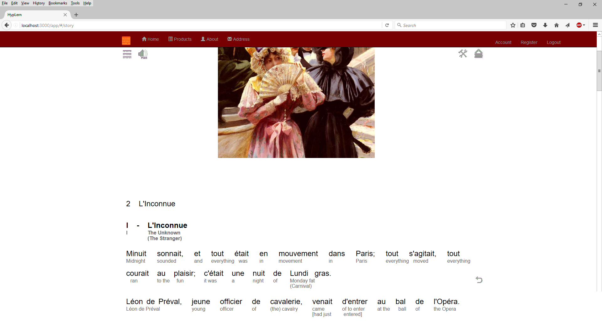

# hyplern-web

<b>In progress</b>

  <li>rewriting code to ES6 syntax and using webpack (with babel to transpile to 2015)</li>
  <li>changing form to include story and language progress</li>

<b>Description</b>

Single page application website in angular, bootstrap and jquery set up as showcase for the interlinear, interlinear on-demand and pop-up content of the HypLern reader e-books and apps.

</img>

This site has been created using the Ittolaja Angular-Bootstrap site generator, currently batch file and perl script based. See the resulting site.json file in app/public. The next version of the hyplern-web site will be based on the next generation Ittolaja generator which will work through interactive web panels and MongoDB storage.

Includes modified partial copy of node-login Copyright (c) 2013 Stephen Braitsch, which is being replaced by angular based user administration system. 

Here is an example of the new Hyplern-Web application form with chosen language with a drop down to choose another language to study, including percentage completed for that language, and current story for that language, and finally a direct link to the current story via the image:

</img>

Example of story in interlinear format (other formats possible are interlinear on-demand or pop-up):

</img>

